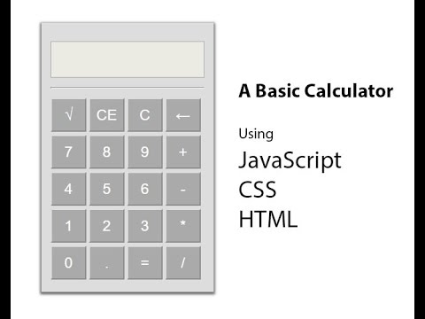

# CALCULATOR PROJECT

in this project, you as a team will build a calculator using HTML, css and pure javascript (you are welcome to use jQuery)

please see the sample calculator images, but it does not have to be the same.

You have 2 hours to finish the hackathon and present it to other students.

No specific guideline is provided on purpose, so please take a moment or see the past project, online resource how to set up basic development template.

1. Plan what features you want to provide
2. set up some basic HTML + css + javascript template so that everyone can work on or split javscript and css work
3. do research which css library (e.g. bootstrap, material, semantic and so on...) to use and learn how to use the library
4. work together how to join css and javascript work together so that your calculator provides both features and nifty design as well

Enjoy :)

### sample images (you should build something like these in HTML with CSS)

